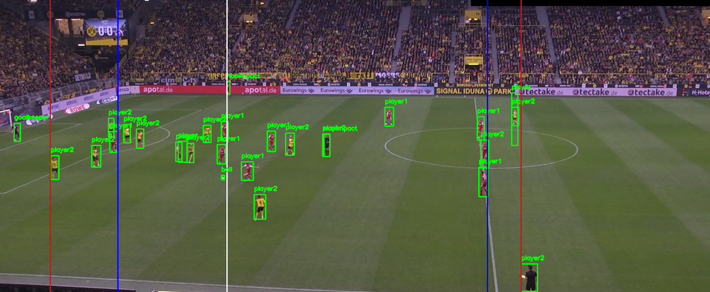

# Football-Player-Detection-and-Team-Segmentation

This project uses YOLOv5 to detect football players, the ball, and other elements in a video. It groups players into two teams by clustering based on their jersey colors using KMeans clustering in the LAB color space. It also marks lines for the ball and the leftmost and rightmost players of each team, helping track player positions and interactions with the ball.

## Result

  

